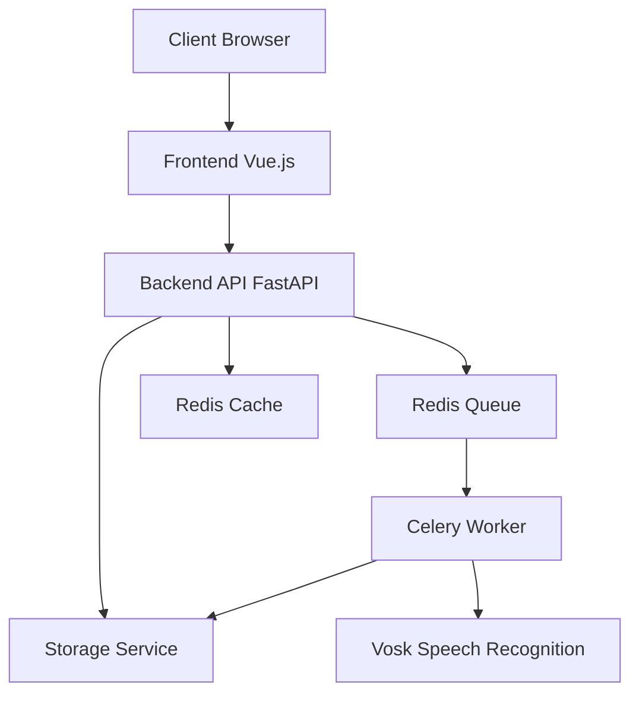
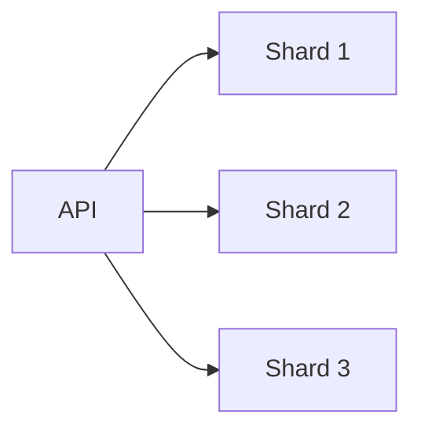
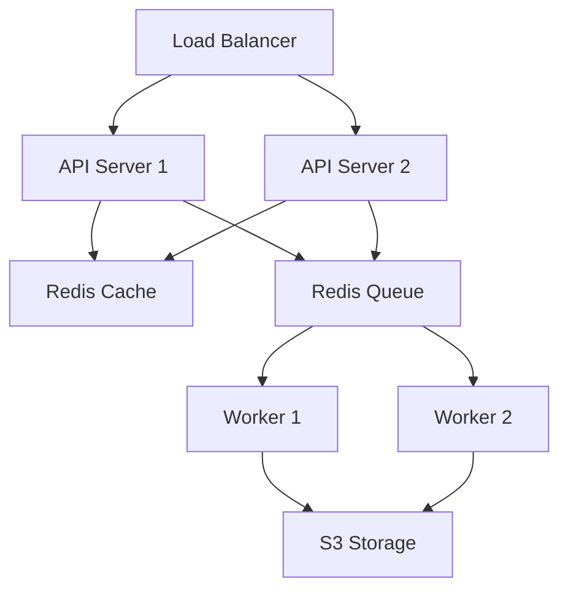
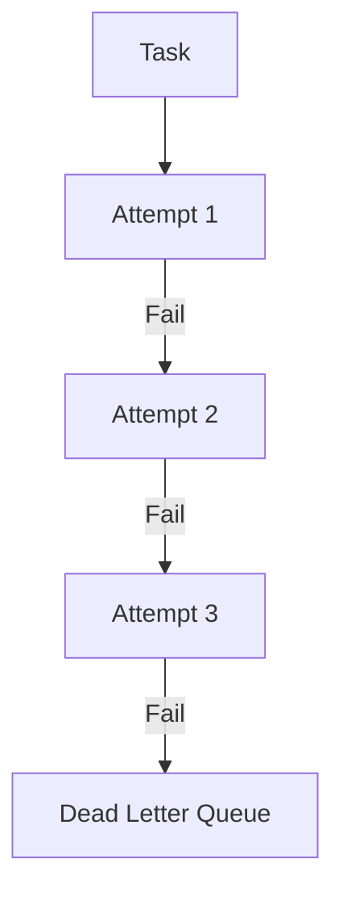

# Video Subtitler Mimari Dokümantasyonu

## Sistem Mimarisi

### Genel Bakış

Video Subtitler, video dosyalarından otomatik altyazı oluşturan bir web uygulamasıdır. Sistem aşağıdaki ana bileşenlerden oluşur:

1. Frontend (Vue.js)
2. Backend API (FastAPI)
3. Worker Service (Celery)
4. Message Broker (Redis)
5. Storage Service (Local/S3)
6. Speech Recognition Engine (Vosk)



### Bileşenler

#### 1. Frontend

- **Teknoloji**: Vue.js 3
- **Özellikler**:
  - Drag & drop video upload
  - Real-time işleme durumu
  - Altyazı önizleme ve düzenleme
  - Responsive tasarım
- **State Management**: Vuex
- **Build Tool**: Vite

#### 2. Backend API

- **Framework**: FastAPI
- **Özellikler**:
  - Asenkron request handling
  - WebSocket desteği
  - Rate limiting
  - Input validation
- **Security**:
  - CORS
  - Rate limiting
  - File validation
  - XSS protection

#### 3. Worker Service

- **Framework**: Celery
- **Görevler**:
  - Video işleme
  - Speech recognition
  - Altyazı oluşturma
  - Video optimizasyon
- **Scaling**:
  - Horizontal scaling
  - Auto-scaling support
  - Task prioritization

#### 4. Message Broker

- **Teknoloji**: Redis
- **Kullanım**:
  - Task queue
  - Caching
  - Session storage
  - Real-time messaging

#### 5. Storage Service

- **Seçenekler**:
  - Local filesystem
  - Amazon S3
  - Azure Blob Storage
- **Özellikler**:
  - Versioning
  - Encryption
  - Access control
  - CDN integration

#### 6. Speech Recognition

- **Engine**: Vosk
- **Özellikler**:
  - Offline çalışma
  - Türkçe dil desteği
  - Yüksek doğruluk
  - Gürültü toleransı

## Veri Akışı

1. **Video Upload**:
   ```mermaid
   sequenceDiagram
       Client->>Frontend: Upload Video
       Frontend->>API: POST /upload
       API->>Storage: Save Video
       API->>Queue: Create Task
       API->>Client: Return video_id
   ```

2. **Video Processing**:
   ```mermaid
   sequenceDiagram
       Worker->>Storage: Get Video
       Worker->>Vosk: Process Audio
       Worker->>Storage: Save Subtitles
       Worker->>Cache: Update Status
   ```

## Scaling Stratejisi

### Horizontal Scaling

- Frontend: CDN + Multiple instances
- Backend: Load balancer + Multiple instances
- Workers: Auto-scaling worker pools
- Storage: Distributed storage system

### Database Sharding



## Monitoring ve Logging

### Metrics

- Request latency
- Error rates
- Processing times
- Resource usage
- Queue length

### Logging

- Structured logging
- Centralized log collection
- Log rotation
- Error tracking

## Security

### Authentication & Authorization

- JWT based auth
- Role based access control
- API key management

### Data Protection

- At rest encryption
- In transit encryption
- Regular backups
- Data retention policy

## Deployment

### Environments

- Development
- Staging
- Production

### Infrastructure



## Error Handling

### Retry Mekanizması



## Performance Optimizasyonları

1. **Caching Stratejisi**
   - Response caching
   - Database query caching
   - Static asset caching

2. **Resource Optimization**
   - Image/video compression
   - Lazy loading
   - Code splitting

## Maintenance

### Backup Stratejisi

- Daily incremental backups
- Weekly full backups
- Multi-region replication
- Point-in-time recovery

### Monitoring Alerts

- Service health
- Error rates
- Resource usage
- Security events

## Disaster Recovery

### Recovery Point Objective (RPO)

- Database: 5 dakika
- Storage: 1 saat
- Configuration: 24 saat

### Recovery Time Objective (RTO)

- Critical services: 1 saat
- Non-critical services: 4 saat 